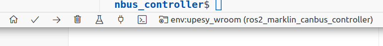

# Brief instructions programming ESP32 devices with VisualCode/Platform IO

In this chapter the most important functions of programming an ESP32 device wit Visual Code and the PlatformIO plugin are described.

1. Start Visual code
2. Enable PlatfomIO environment(see: Visual Code/PlatfomIO documentation)
    * [Visual Code docs](https://code.visualstudio.com/docs)
    * [PlatfomIO code](https://docs.platformio.org/en/latest/core/index.html)
3. Select ESP32 workspace:
    * __File-->Open Workspace from File...-->esp32.code-workspace__ (in the ESP32 folder of this repository)

(_Warning: Sometimes Visual Code display's it's dialogs behind the main window, toggle to the dialog window_)

Commands can be given over the status bar at the buttom-side of the Visual Code Windows, see below.

4. Select project to program the ESP32, by hoving over the status bar and click the __Switch PlatormIO project Environment__.

    Next, select project from Projects list window:

5. Build project, by hoving over the status bar and click the __Build__ button, no erros should appear in the Therminal

6. Connect ESP32 device to the computer throug a USB-cable.

7. Upload the program to the ESP32, by hoving over the status bar and click the __Upload__ button, no erros should appear in the Therminal

7. Alternaty you can monitor the output of the program in the serial monitor window, by hoving over the status bar and click the __Serial Monitor__ button.

