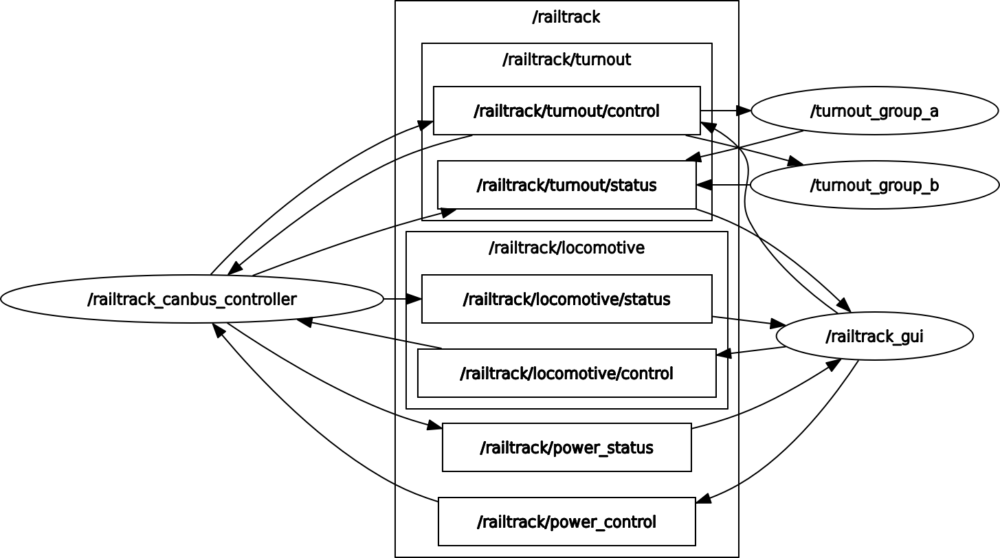

# ROS2 Railtrack System overview

__Graph__

__Topics__

Syntax \<topic\>:\<ros2 interface\>

___Locomotive topics___
[/railtrack/locomotive/control: railway_interfaces.msg.LocomotiveControl](../esp32/ros2_marklin_canbus_controller/extra_packages/railway_interfaces/msg/LocomotiveControl.msg)

[/railtrack/locomotive/status: railway_interfaces.msg.LocomotiveState](../esp32/ros2_marklin_canbus_controller/extra_packages/railway_interfaces/msg/LocomotiveState.msg)

___Turnout topics___
[/railtrack/turnout/control: railway_interfaces.msg.TurnoutControl](../esp32/ros2_marklin_canbus_controller/extra_packages/railway_interfaces/msg/TurnoutControl.msg)

[/railtrack/turnout/status: railway_interfaces.msg.TurnoutState](../esp32/ros2_marklin_canbus_controller/extra_packages/railway_interfaces/msg/TurnoutState.msg)

___Power topics___

/railtrack/power_control: std_msgs.msg.Bool

/railtrack/power_status: std_msgs.msg.Bool