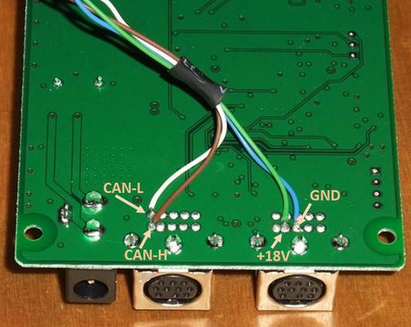

# Setup Marklin Railbox Bridge

Under Construction

Digital Connector Box

[List of Components](https://docs.google.com/spreadsheets/d/18TnnurDtuM7WNLGjFARisbmxjI6zFRmcXOZzPikqvao/edit?usp=sharing)

### ESP32-wroom32 pinouts:

### ESP32-wroom32(mini) pinouts:

[Connectiontable Railbox Bridge](https://docs.google.com/spreadsheets/d/1lZ0bYcd9MC5ZJBcrFeeLdLd2YKi_yTghrkXhHs3W9o0/edit?usp=sharing)

Connections to the Marklin Railbox can be made by:
* Soldering wires to the PCB of the Railbox, see image below
* Connection by a 10 pin plug(_I did not find a compliant plug on the internet_)

[Reference](https://www.marklin-users.net/forum/posts/t36089-Computer-interface-for-Marklin-Track-Box-and-mfx-programming)

[Programming instructions](instructions_programming_esp32.md)(Note: Select project ___ros2_marklin_canbus_controller___)

[Back](../README.md)