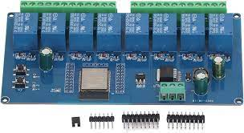
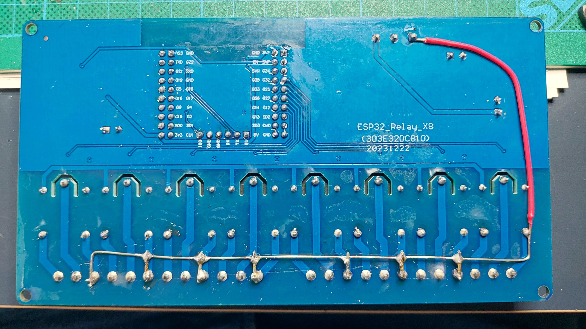
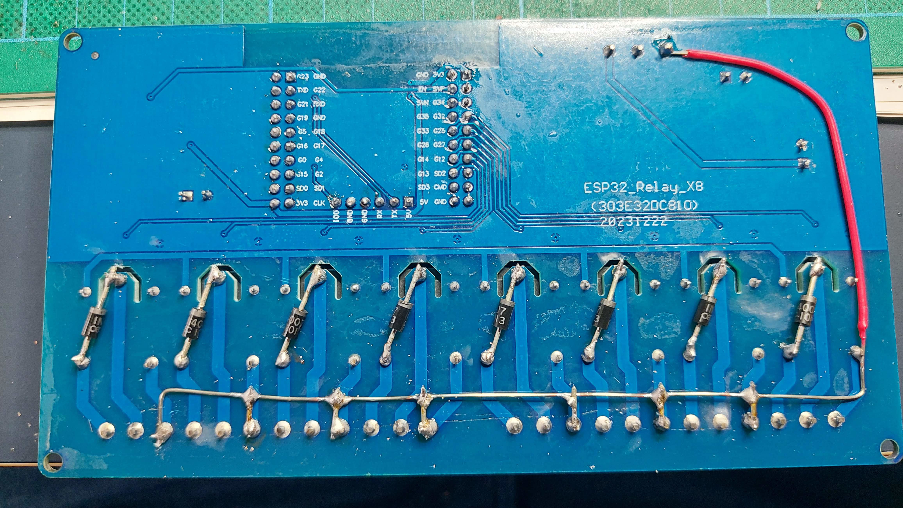
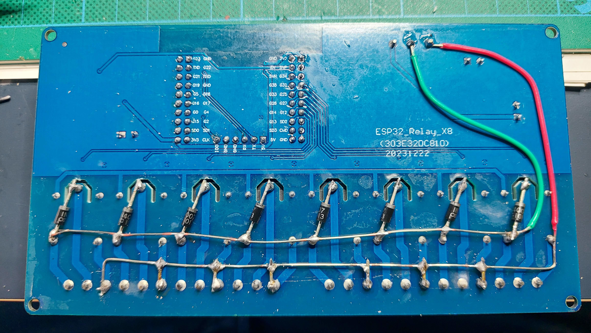
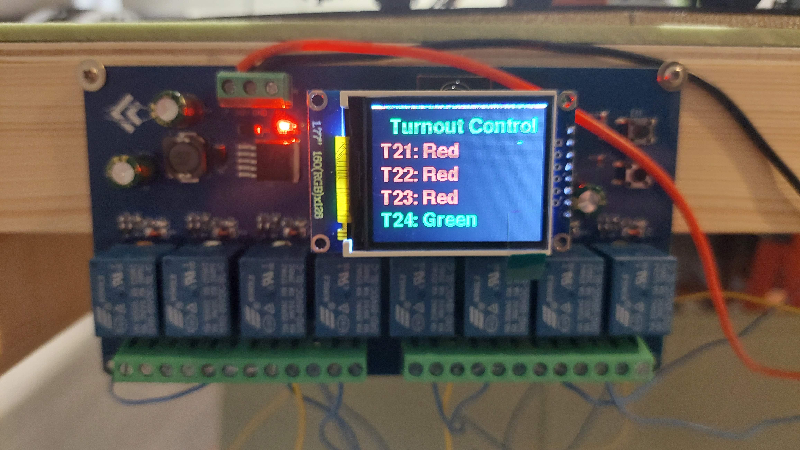
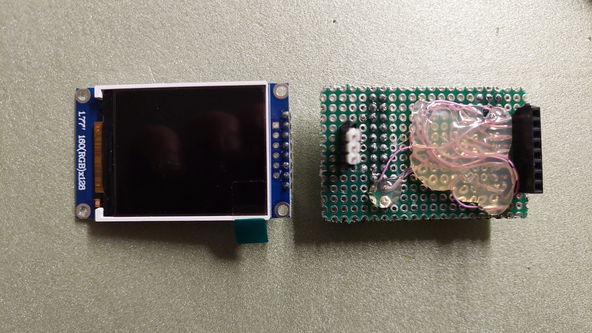
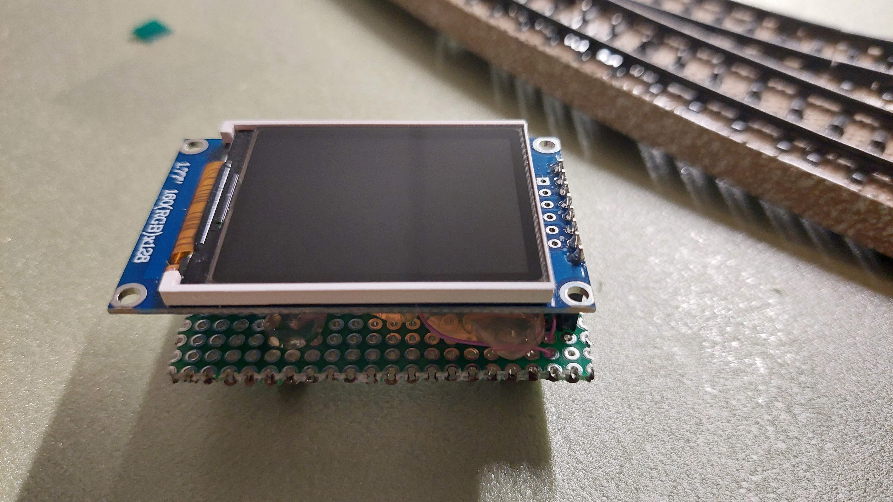

# Turnout controller Example

Under Construction

This is a example of a hardware implementation for controlling 4 solenoid turnous by a __8 channel ESP32 Relay board__

[Partlist](https://docs.google.com/spreadsheets/d/1blaNgdvi-0lFEaQ-nMM7tEV-90qDb38QVJ2TUBspOQ8/edit?usp=sharing)

[Documentation of the relayboard by Werner Rothschopf](https://werner.rothschopf.net/microcontroller/202208_esp32_relay_x8_en.htm)

### Modifications on the Board ###
To supply the board and turnouts with a single 12V DC adapter, make the folowing modifications. You need only supply the board through the DC7-30V and GND connections(DC5V can be left open)

1. Wire 12 Volts

2. Wire diodes (Optional, to prevent burning-in relay contacts)

3. Wire GND

### Connections of the turnouts
[Connectiontable of the turnouts](https://docs.google.com/spreadsheets/d/1gRFCZ1HvVopqZunI1NFgUJWMyBfiNZ6XEHDdcQGjpi4/edit?usp=sharing)

### Extend the board with a (status)display
You can optionaly extend the controller with a display.

[Connectiontable for display](https://docs.google.com/spreadsheets/d/1QX-6jUv3QRhAGAogjCkY_kp1XdK-jJ_qZqqPhJOJk5Y/edit?usp=sharing)

Adaptor for the display

### Example of configuration
The files turnout_config_a.json and turnout_config_b.json in the config directory of this repository gives a good example of configuring the board.

[Programming instructions](instructions_programming_esp32.md)(Note: Select project ___ros2_turnout_controller___)

[Back](../README.md)